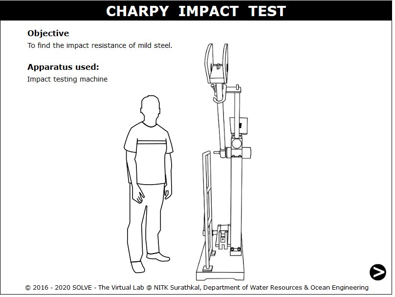
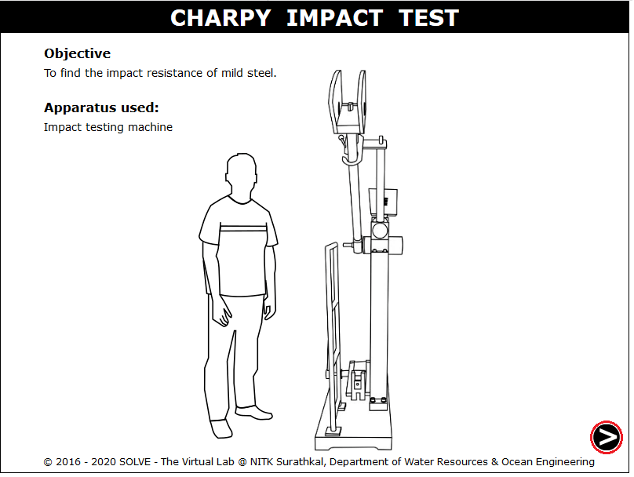
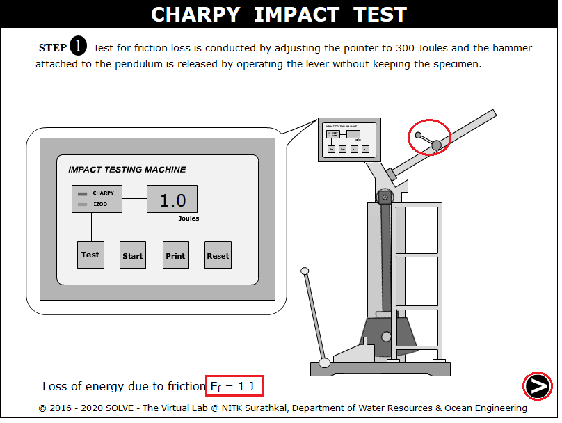
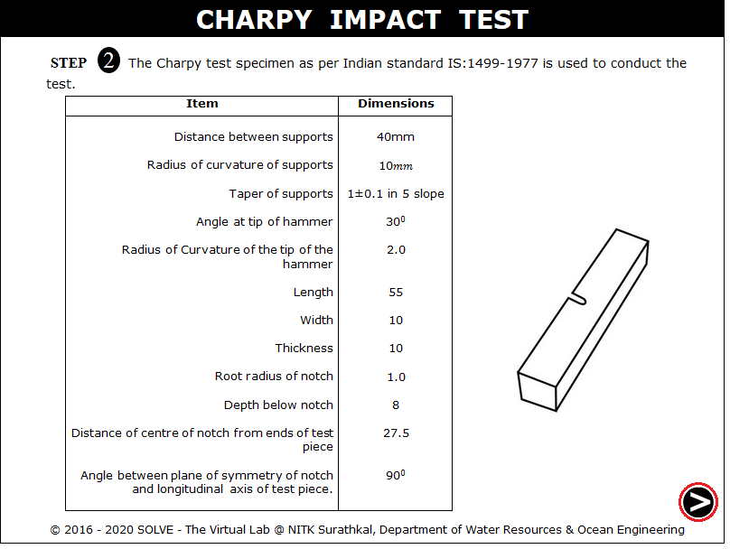
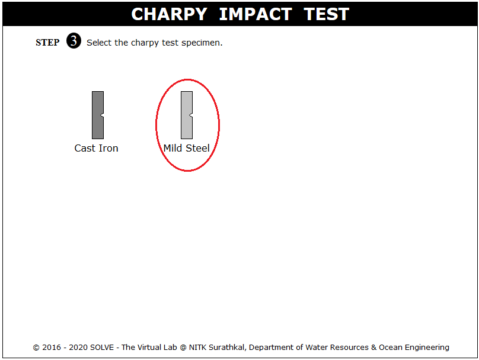
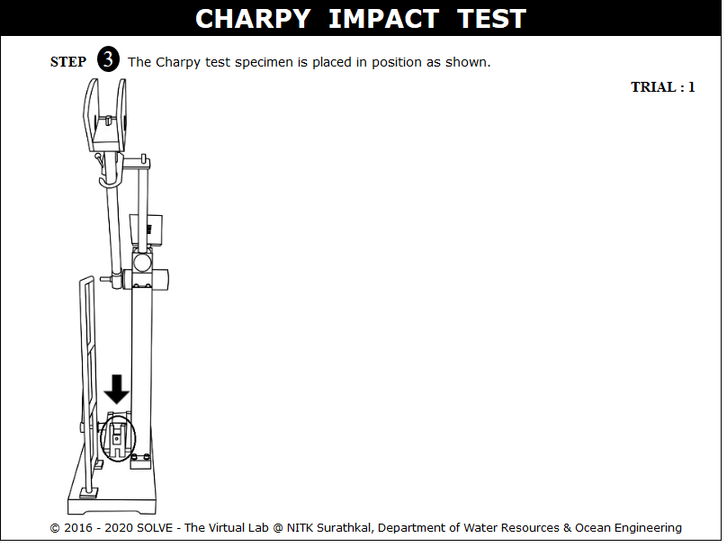
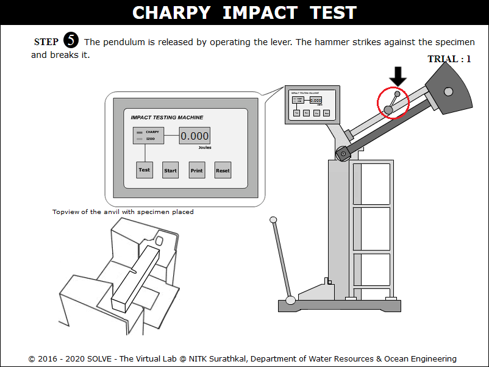
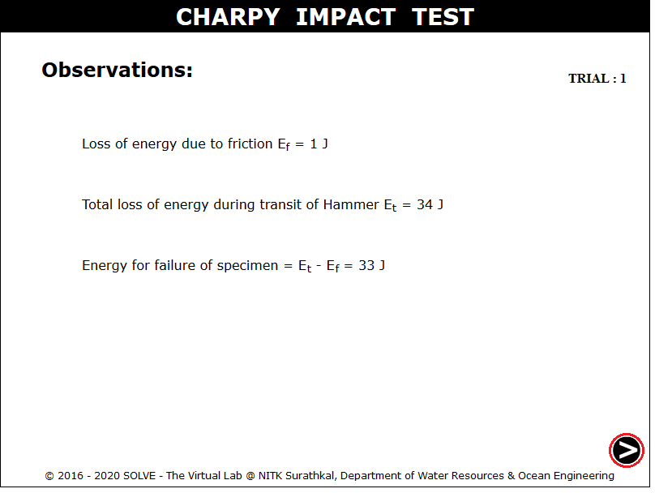
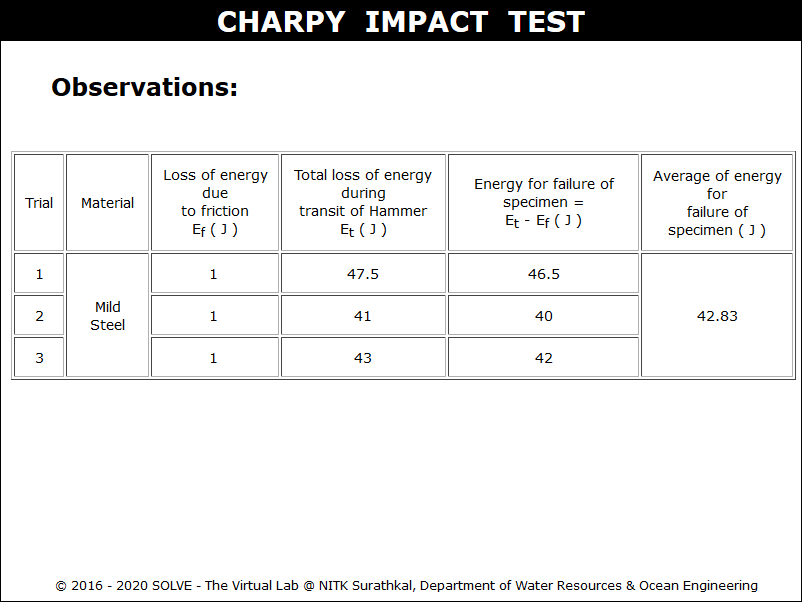

**OBJECTIVE**:

To find the impact resistance of mild steel specimen and cast iron.

**STEPS**:

1. When you click on charpy test file a window will open as shown below.  
   

2. Click on the NEXT button to move to the next step.  
   

3. Click on the hand lever to check for friction loss. Then click on NEXT button to move to next step.  
   

4. Specifications of testing machine and standard specimen as per standard code will appear on a window. Click on the next button.  
   

5. Click on material of the specimen to select the material to be tested.  
   

6. Now the specimen is placed in the testing machine, click where the arrow is pointing and drag the specimen.  
   

7. Click on the hand lever to obtain the total loss of energy during the transmit.  
   

8. The final result will be obtained as follows.  
   

9. The experiment is carried out for Two more trials and the final results are obtained.  
   
