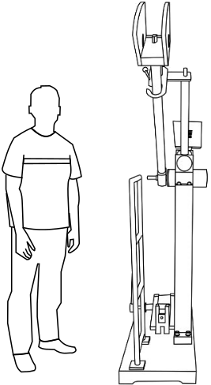
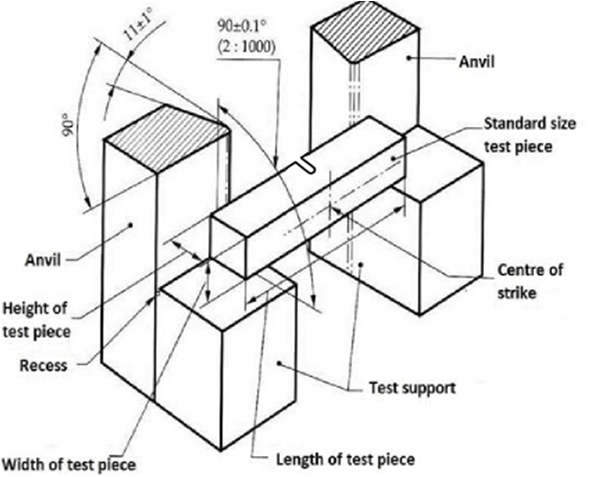
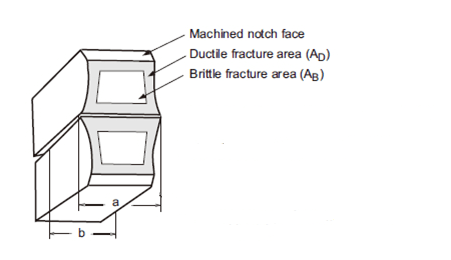

Toughness is the ability of the material to withstand crack i.e., to prevent the transfer or propagation of the cracks across its section hence causing failure. Impact testing machine consists of a pendulum suspended from a short shaft that rotates in ball bearing and swings midway between two rigid upright stands supported on a rigid base. According to Indian Standard the speed of pendulum at the instant of striking shall be 4.5 - 7 m/s and the plane of swing of the striker shall be vertical and within 0.5 mm of the plane midway between the supports. The pendulum can be raised to any desired height and rested at that position. It is supported in the starting position by a catch and can be released by a trigger. The mechanism is so designed that the pendulum is not disturbed when the catch is released. The striking energy of the testing machine should be 300±10J for standard testing.

In impact test a specially prepared notched specimen is fractured by a single blow from a hammer and energy required being a measure of resistance to impact. Impact load is produced by a swinging of an hammer weight W from a height h, release of the hammer from the height h swings the hammer through the arc of a circle, which strikes the specimen to fracture at the notch (Kinetic energy of the hammer at the time of impact is mv2/2), which is equal to the relative potential energy of the hammer before its release is mgh,
Where, m is the mass of the hammer and v is its tangential velocity at impact=2gh, g is gravitational acceleration (9.806 m/s2) and h is the height through which hammer falls.

The difference between potential energies is the fracture energy.

Fracture Energy = mgh(h0 - hf)

This value is called impact toughness or impact value, which will be measured per unit area at the notch. The test consists of measuring the energy absorbed in breaking a notched specimen supported at each end by one blow from a swinging hammer under prescribed conditions.

In addition to the impact energy there are two other features that can be measured and may be found as a requirement in some specifications.These are percentage crystallinity and lateral expansion.

Charpy tests show whether a metal can be classified as being either brittle or ductile. This is particularly useful for materials such as ferritic steels that show a ductile to brittle transition with decreasing temperature. A brittle material will absorb a small amount of energy when impact tested, and a tough ductile metal absorbs a large amount of energy. The appearance of a fractured surface also gives information about the type of fracture that has occurred, a brittle fracture will be bright and crystalline, and a ductile fracture will be dull and fibrous. Then the percentage crystallinity is determined by making a judgement of the amount of crystalline or brittle fracture on the surface of the broken specimen, and is a measure of the amount of brittle fracture.

Above curve shows that a ductile fracture absorbs a greater amount of energy than a brittle fracture in the same material.At higher temperatures the impact energy is relatively large since the fracture is ductile. As the temperature is lowered, the fracture becomes more brittle. When a ductile metal is broken, the test-piece deforms before breaking, a pair of 'ears' being squeezed out on the side of the compression face of the specimen. The amount by which the specimen deforms in this way is measured as lateral expansion and expressed as millimetres of lateral expansion.

The percent shear area on the fracture surface of a charpy impact specimen typically calculated as the difference between the total fractured area (Fracture Initiation Region, Unstable Fracture region, Shear Lips, and Final Fracture Region) and the unstable fracture area, divided by he total fractured area, times 100.

**TEST SPECIMEN**:

The standard test piece shall be machined all over and shall have a square cross-section 10 mm x 10 mm sides, 55 mm long and in the centre of the length of one face there shall be a U-notch of specified depth with 1 mm root radius. Where the standard test piece cannot be obtained from the material then one of the subsidiary test pieces having a rectangular cross-section shall be used with the notch cut in one of the narrower faces.

**Unbroken test piece**:

During the test, if the test piece is not completely broken then the impact value obtained is indefinite. In test report it should be stated that the test piece was not broken by striking energy of the testing machine.

<table style="width: 92.5%;">
<tr>
<th rowspan="2"> Dimensions (U-Notch)</th>
<th rowspan="2"> Nominal  </th>
<th colspan="2" style="text-align: center;">Machining Tolerance</th>
</tr>
<tr>
<td>Ferrous test piece</td>
<td>Non-ferrous test piece</td>
</tr>
<tr>
<td>Length</td>
<td style="text-align: center;">55 mm</td>
<td style="text-align: center;">&plusmn; 0.60 mm</td>
<td style="text-align: center;">&plusmn; 0.5 mm</td>
</tr>
<tr>
<td>Width</td>
<td style="text-align: center;">10 mm</td>
<td style="text-align: center;">&plusmn; 0.11 mm</td>
<td style="text-align: center;">&plusmn; 0.05 mm</td>
</tr>
<tr>
<td>Thickness</td>
<td style="text-align: center;">10 mm</td>
<td style="text-align: center;">&plusmn; 0.11 mm</td>
<td style="text-align: center;">&plusmn; 0.025 mm</td>
</tr>
<tr>
<td>Depth below notch</td>
<td style="text-align: center;">5 mm</td>
<td style="text-align: center;">&plusmn; 0.09mm</td>
<td style="text-align: center;">&plusmn; 0.05 mm</td>
</tr>
<tr>
<td>Root radius</td>
<td style="text-align: center;">1 mm</td>
<td style="text-align: center;">&plusmn; 0.07 mm</td>
<td style="text-align: center;">&plusmn; 0.07 mm</td>
</tr>
<tr>
<td>Distance of notch from end of test specimen</td>
<td style="text-align: center;">27.5 mm</td>
<td style="text-align: center;">&plusmn; 0.42 mm</td>
<td style="text-align: center;">&plusmn; 0.25 mm</td>
</tr>
<tr>
<td>Angle between plane of symmetry of notch  and longitudinal axis of test specimen</td>
<td style="text-align: center;">90&deg;</td>
<td style="text-align: center;">&plusmn; 2&deg;</td>
<td style="text-align: center;">&plusmn; 2&deg;</td>
</tr>
</table>

**TYPE OF NOTCHES IN CHARPY TEST**:

**Friction Loss**:

The charpy testing machine involves a pendulum swinging in vertical plane about a horizontal shaft housed in bearings. These bearings exert a frictional resistance, if proper lubrication is not done. By polishing the anvils and the striking bit the energy absorbed due to the friction between the anvils and striking bit can be minimized. To estimate the losses the error test is to be carried out before starting the experiments.

**RELEVANT INDIAN STANDARD FOR CHARPY IMPACT TEST**:

1. IS 1598:1977-Method for Izod impact test of metals
2. IS:3766-1977- Method for calibration of pendulum impact testing machines for testing metals
